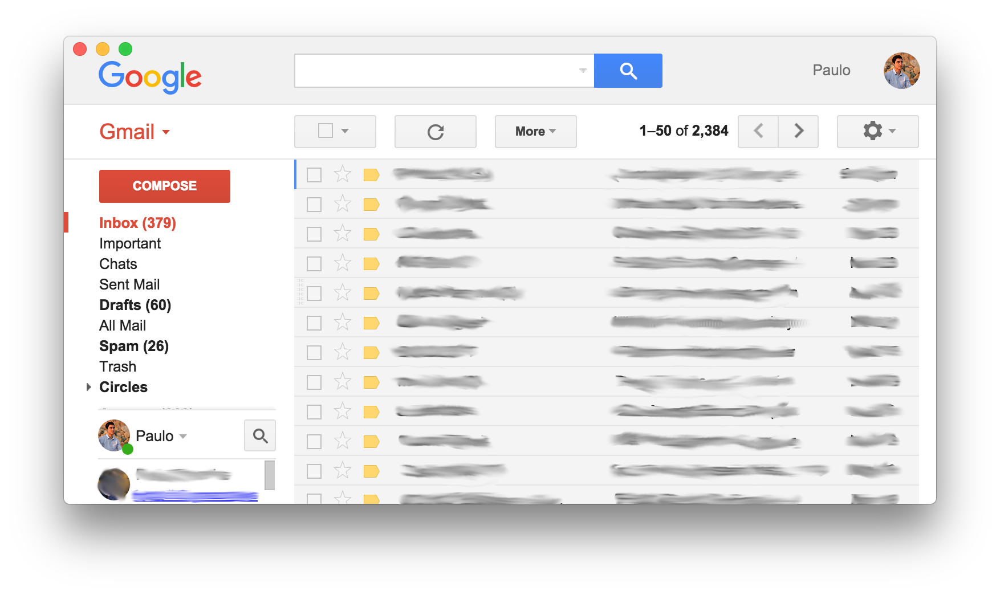
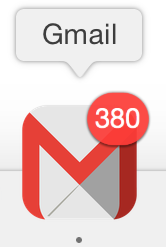

# &nbsp;Gmail

> An Unofficial Gmail native web client built with Electron JS.

 

## Install
Check the current list of [releases](https://github.com/paulot/gmail/releases/latest) for prebuilt binaries.

#### Mac OS
Simply drag the .app file located in the archive to your dock

#### Windows/Linux
Still working on a binary. There are still a few issues with the menu that need to be sorted out in Linux. 

#### Running from source
- Clone the repo: `git clone https://github.com/paulot/gmail.git`
- Install dependencies: `npm install`
- Run: `npm start`

## Development
Built with [Electron JS](http://electron.atom.io).

#### Commands
- Init: `$ npm install`
- Run: `$ npm start`
